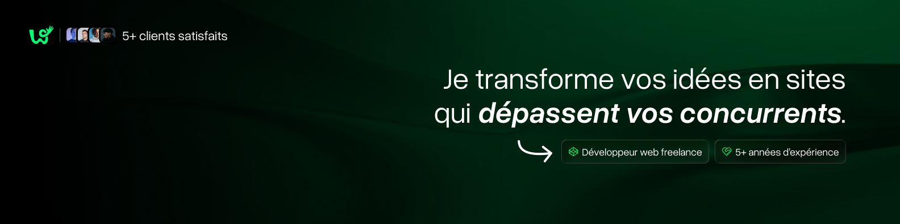

  

<h1 align="center">👋 Salut, je suis Estéban</h1>
<h2 align="center">🚀 Développeur Full Stack Passionné</h2>
<h3 align="center">📍 Basé en France</h3>

 

  

    <strong>Créateur d'expériences numériques innovantes</strong> 
    Spécialisé dans le développement d'applications web et mobiles modernes
  

 

## 🎯 À propos

- 🔭 **Actuellement :** Développement de [mon site web professionnel](https://whimsy-studio.com)
- 💼 **Portfolio :** Découvrez tous mes projets sur [whimsy-studio.com/projects](https://whimsy-studio.com/projects)  
- 📋 **Expérience :** Consultez mon parcours professionnel sur [whimsy-studio.com/about](https://whimsy-studio.com/about)
- 🌱 **Apprentissage continu :** Toujours à la recherche de nouvelles technologies et méthodologies

 

## 🤝 Restons connectés

  
  
  

 

## 🛠️ Stack Technologique

### Frontend

  
  
  
  
  
  
  
  

### Styling & Design

  
  
  
  
  
  
  
  

### Backend & Bases de données

  
  
  
  
  
  

### Bases de données

  
  
  
  
  
  
  

### Mobile & Desktop

  
  
  
  
  

### DevOps & Cloud

  
  
  
  
  
  

### Outils de développement

  
  
  
  
  

---

  

    <strong>💡 "Transformer des idées en solutions numériques élégantes"</strong>
  

  

    <em>Toujours prêt à relever de nouveaux défis technologiques</em>
  

